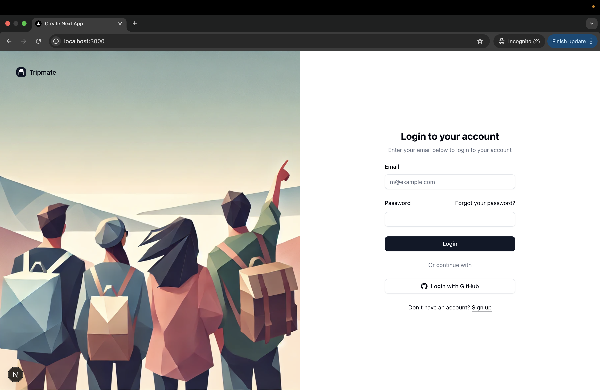
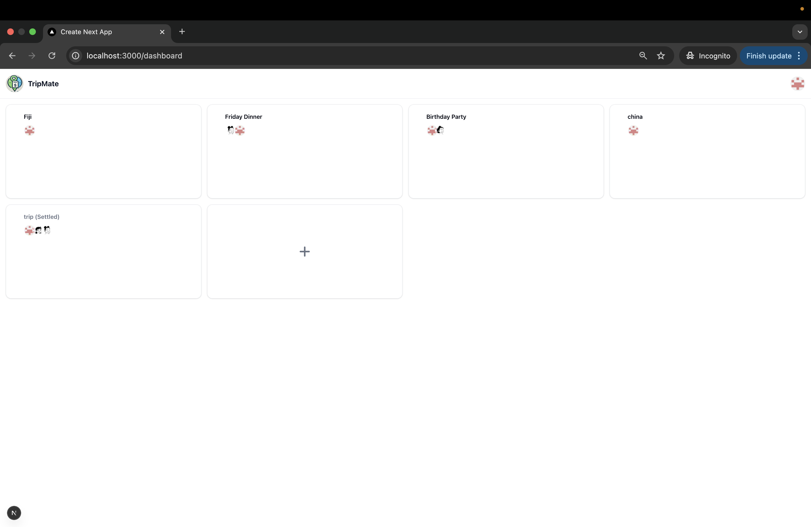
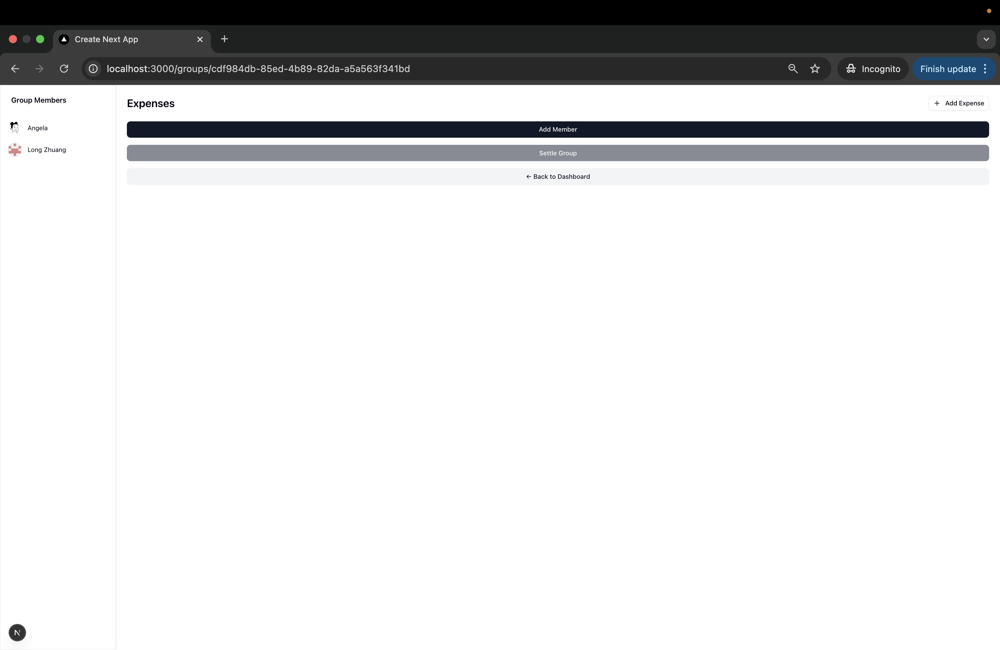
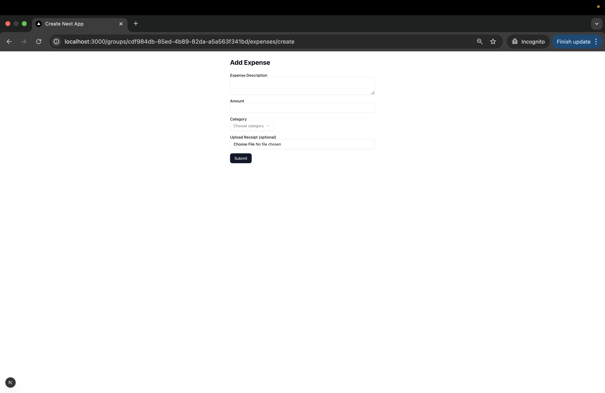

# Project Report

---

## Team Information

| Name        | Student Number | Email Address                  |
| ----------- | -------------- | ------------------------------ |
| Hanzhen Xu  | 1004475285     | hanzhen.xu@mail.utoronto.ca    |
| Long Zhuang | 1005487938     | angela.zhuang@mail.utoronto.ca |

## Motivation

Splitting expenses among friends, family, or colleagues while traveling can lead to confusion. Manual tracking using spreadsheets or messaging apps results in errors, delays, and confusion over who owes what. There is a lack of quick solutions that make it easy to track group expenses, settle debts, and store receipts.

---

## Objectives

Develop a **full-stack web application** using **Next.js** that enables users to **create trip groups, add expenses, track balances, and settle debts efficiently**, all while ensuring **data integrity, security, and collaboration**.

---

## Technical Stack

- **Frontend**: Next.js 13+ with App Router, Tailwind CSS, and shadcn/ui.
- **Backend**: Next.js API Routes for backend logic.
- **Database**: PostgreSQL for structured data storage.
- **Cloud Storage**: AWS S3 for receipt file handling.
- **Authentication**: BetterAuth with Github OAuth.

---

## Main Features

## 3. Core Features & Functionality

### A. User Authentication & Authorization

- **GitHub OAuth** authentication implemented using **BetterAuth**.
- Secure session handling with **server-side token validation**.
- **Role-based access control** ensures that only group members can:
  - Add or edit expenses
  - Delete expenses
  - Settle group debts

### B. Dashboard (`/`)

- Displays **user’s avatar** and a **pannel of group cards** that the user is part of.
- **Buttons:**
  - `Create Group`: Allows users to create a new group with a trip name and description.
- **Loading and error handling** for fetching user groups.

---

### C. Group Page (`/group/[id]`)

#### **Left Panel**

- Displays the **list of users** in the group.

#### **Right Panel**

- Displays the **list of expenses** added by users within the group.
- Each expense should have:
  - `Delete` button to trigger deletion confirmation.

#### **Each Expense Entry Shows:**

- Who paid.
- Total amount.
- Timestamp (ordered by the time added).
- Link to visit the image uploaded.

#### **Submit New Expense Button**

- Allows users to **submit a new expense** paid by them.
- Opens **Expense Management** modal form.
- **Default**: All group members split the expense equally.
- **Formula**:
  ```math
  (Total Expense) / (Number of Participants + 1) = Amount Each Participant Owes
  ```

#### **Settle Button (Group Creator Only)**

- Computes and simplifies transactions to determine who owes whom.
- Displays **minimal set of payments needed** to settle the group debts.

#### **Group Invitation Button**

- The group creator can invite others by entering their email address.

#### **Group Invitation Button**

- Click to navigate back to the dashboard.

---

### D. Expense Management (Modal)

#### **Modal Form Fields**

- **Expense Description** (Required, text input)
- **Amount** (Required, decimal input)
- **Category Selection** (Food, Travel, Lodging, Miscellaneous)
- **Upload Receipt** (Optional, file upload to AWS S3)

---

#### **Form Fields**

- **Expense Description** (Required, text input)
- **Amount** (Required, decimal input, min=0.01)
- **Category Selection** (Dropdown: Food, Travel, Lodging, Miscellaneous)
- **Upload Receipt** (Optional, allows replacing existing receipt)

---

### F. Delete Functionality

- Each expense should have a **`Delete Expense`** button.
- Clicking the delete button triggers a **confirmation dialog**:
  "Are you sure you want to delete [expense description]?"
- **If OK is clicked**:
  - Deletes the expense from the database.
  - Displays `Expense deleted successfully`.
- **If Cancel is clicked**:
  - Closes the dialog without action.
- **If deletion fails**:
  - Displays `Error deleting expense`.

---

### G. Settle Debts (`/group/[id]/settle`)

- Only the **group creator** can click `Settle`.
- Computes a **final settlement summary** and shows it in a modal, waiting for **group creator** to `Confirm`.

---

## 4. Course Project Requirement Checklist

### Core Technical Requirements

- ✅ **Frontend Requirements**

  - **React or Next.js for UI development** → Implementing with **Next.js**.
  - **Tailwind CSS for styling**
  - **shadcn/ui** → Forms and modals from shadcn/ui are used.
  - **Responsive design implementation** → Short forms use modal to make the experience responsive.

- ✅ **Data Storage Requirements**
  - **PostgreSQL for relational database** → Using **PostgreSQL**.
  - **Cloud storage for file handling** → Implementing **AWS S3** for uploading and storing receipts.

### Architecture Approach

- ✅ ** Next.js Full-Stack**
  - **Next.js 13+ with App Router**
  - **Server Components for backend logic**
  - **API Routes for data handling**
  - **Server Actions for mutations**

### Advanced Features (Must Implement at Least Two)

- ✅ **User authentication and authorization** → Implementing **Github OAuth authentication** via **NextAuth.js**.

- ✅ **File handling and processing** → **AWS S3 integration** for **receipt uploads**.

This ensures that the **TripMate** project fully meets all core requirements and implements multiple advanced features.

This is a [Next.js](https://nextjs.org) project bootstrapped with [`create-next-app`](https://nextjs.org/docs/app/api-reference/cli/create-next-app).

## User Guide

---

### Sign In

- Users sign in using **email and password** or **GitHub OAuth** via the login page.
- Upon signing in, users are redirected to their **Dashboard**.



---

### Dashboard

- The dashboard displays:
  - Current User avatar on the top right corner
  - Sign out button
  - List of groups cards
  - Each group card display avator of users belong to the group
  - Buttons card to **Create** a new Group\*\*



---

### Group Page

- Clicking a group redirects to the **Group Details Page**.
- Left panel: List of group members
- Top Left Corer: Add Expense buttom to submit a new expense
- Right panel: List of all submitted expenses with the information below:
  - Who paid, amount, participants, timestamp, and view image link (optional)
  - Options to **Delete** each expense
- Only Group creator have the clickable **Settle** button.



---

### ➕ Add / Edit Expense

- Click `Submit New Expense` to open the expense form modal.
- Form fields:
  - Description, amount, category, and optional receipt upload



---

## Video Demo

A demonstration video of using the app is available at the followng link:
[Watch the demo video](https://www.youtube.com/watch?v=G1jJc9OkhYY)

---

## Development Guide

This section describes how to set up the development environment, configure the database, integrate cloud storage, and run the application locally.

---

## 1. Environment Setup & Configuration

### Initial Setup

1. Clone the repository and navigate to the project directory.

```bash
cd tripmate
```

2. Run the prisma db:

```bash
npx prisma migrate dev --name init
```

3. Install dependencies and start the development server:

```bash
npm install
npm run dev
```

### Stuck at Compile?

If the server hangs or gets stuck during compile, clean the cache:

```bash
rm -rf .next node_modules package-lock.json
npm install
npm run dev
```

3. Set Up Environment Variables:

```
cp .env.example .env
```

---

## 2. Database Initialization

We use **Prisma** with **PostgreSQL** for database management.

To initialize the database:

```bash
npx prisma migrate dev --name init
```

This command sets up the database schema defined in `prisma/schema.prisma`.

You can then visit the app at: [http://localhost:3000](http://localhost:3000)

---

## 3. Cloud Storage Configuration (AWS S3 for Receipt Uploads)

We use **AWS S3** to securely store uploaded receipt images. Follow these steps:

### Step 1: Create an S3 Bucket

1. Go to the [AWS Console](https://console.aws.amazon.com/).
2. Navigate to **S3** and click **Create bucket**.
3. Set a unique bucket name (e.g., `my-receipt-storage`).
4. Choose the desired region.
5. Keep **public access disabled** for security.
6. Click **Create bucket**.

### Step 2: Create IAM User and Permissions

1. Go to **IAM > Users > Add user**.
2. Choose **Programmatic access**.
3. Attach **AmazonS3FullAccess** (for development only).
4. Save the **Access Key ID** and **Secret Access Key**.

### Step 3: Environment Variables

Add the following to your `.env` file:

```env
AWS_ACCESS_KEY_ID=your-access-key-id
AWS_SECRET_ACCESS_KEY=your-secret-access-key
AWS_REGION=your-region
AWS_BUCKET=my-receipt-storage
```

---

## 4. Local Development & Testing

- Start the development server:

  ```bash
  npm run dev
  ```

- Make changes to components such as `app/page.tsx` — the page will auto-update.
- This project uses [`next/font`](https://nextjs.org/docs/app/building-your-application/optimizing/fonts) to load the [Geist](https://vercel.com/font) font for a clean, modern UI.

## Team Contribution

### **Hanzhen Xu: Backend & Authentication**

- Set up the **PostgreSQL database schema** using Prisma ORM.
- Implemented **user authentication** using BetterAuth with GitHub OAuth.
- Handled backend **database operations** and **session validation**.
- Created Group Demo

### **Lond Zhuang: Frontend & Cloud Integration**

- Developed and styled core UI components with **Next.js frontend** using Tailwind CSS and shadcn/ui components.
- Integrated **AWS S3** for **secure receipt image storage**.
- Crafted Final Report

### **Joint Responsibilities**

- Collaborated on frontend-backend integration.
- Conducted bug fixes, code cleanup, and optimizations.
- Reviewing each other’s code to ensure best practices.

## Lessons Learned and Concluding Remark

This Project helped us strengthen our understanding of full-stack web development using Next.js, PostgreSQL, and cloud services like AWS S3. We gained hands-on experience with authentication flows, database schema design, file uploads, and team-based collaboration using Git.

Throughout development, we encountered and overcame, server/client side separation, async data handling, and UI/UX improvements. These experiences deepened our appreciation for clean architecture, modular design, and testing practices.

## Learn More

To learn more about Next.js, take a look at the following resources:

- [Next.js Documentation](https://nextjs.org/docs) - learn about Next.js features and API.
- [Learn Next.js](https://nextjs.org/learn) - an interactive Next.js tutorial.

You can check out [the Next.js GitHub repository](https://github.com/vercel/next.js) - your feedback and contributions are welcome!

<!-- ## Deploy on Vercel

The easiest way to deploy your Next.js app is to use the [Vercel Platform](https://vercel.com/new?utm_medium=default-template&filter=next.js&utm_source=create-next-app&utm_campaign=create-next-app-readme) from the creators of Next.js.

Check out our [Next.js deployment documentation](https://nextjs.org/docs/app/building-your-application/deploying) for more details. -->
